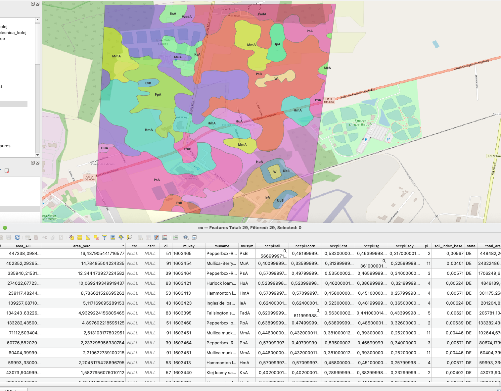

# SSURGO DB

## Run by docker
### Requirements:
- disk : 170GB
- docker
- docker-compose

### Instalation
execute
```shell
docker-compose up -d --build
```
Database with table will be created, after that You can import entire SSURGO database by running this in command:
```shell
docker exec soil-api python import_soils.py
```

## Run without docker
Create database:
```postgresql
create database soil_data;
\c soil_data
create extension postgis;
create extension "uuid-ossp";
```
```shell
psql -h hostname -p port_number -U username -f db_scripts/extensions.sql.sql soil_data
```

Install requirements:
```shell
pip install -r requirements.txt
```

Run import:
```shell
python import_soils.py
```

Start api:
```shell
python sapi.py &
```

## Logging during import
When import is in progress, script fills table ssurgo.importlog where progress can be check, also information about errors can be checked.
Example log from import:
```
          timelog           | ltype |                    description                    
----------------------------+-------+---------------------------------------------------
 2022-12-23 11:45:10.187024 | info  | uploading mupolygon layer for state - CT, [START]
 2022-12-23 11:48:49.018745 | info  | uploaded mupolygon layer for state - CT, [END]
 2022-12-23 11:48:50.090459 | info  | uploaded aggreg table for state - CT
 2022-12-23 11:48:51.588217 | info  | uploaded component table for state - CT
 2022-12-23 11:48:51.997593 | info  | uploaded mapunit table for state - CT
 2022-12-23 11:48:52.5509   | info  | uploaded valu1 table for state - CT
 2022-12-23 11:48:52.987305 | info  | uploaded muaggatt table for state - CT
 2022-12-23 11:49:25.847711 | info  | uploading mupolygon layer for state - NH, [START]
 2022-12-23 11:52:11.187335 | info  | uploaded mupolygon layer for state - NH, [END]
 2022-12-23 11:52:12.334249 | info  | uploaded aggreg table for state - NH
 2022-12-23 11:52:15.797883 | info  | uploaded component table for state - NH
 2022-12-23 11:52:16.23989  | info  | uploaded mapunit table for state - NH
 2022-12-23 11:52:17.014959 | info  | uploaded valu1 table for state - NH
 2022-12-23 11:52:17.897189 | info  | uploaded muaggatt table for state - NH
 2022-12-23 13:25:36.699524 | ERROR | Cannot download file list from BOX
 2022-12-23 13:26:59.014176 | ERROR | Cannot download file list from BOX
 2022-12-23 13:27:14.767075 | ERROR | Cannot download file list from BOX
 2022-12-23 13:27:50.71972  | ERROR | Cannot download file list from BOX
```

# SSURGO API
Currently it is configured as very simple flask app that fetch data from DB and returning geojson/json depending on query. Queries supported:

## query BBOX
```browser
http://localhost:5000/get-features-bbox/-75.37789,38.68661,-75.35817,38.70375
```
As responce geojson will be returned with:
- geometries as multipolygons (wkt 4326) not clipped to bbox will be returned

and attributes:
- mukey
- musym
- csr 
- csr2
- muname 
- nccpi3soy
- nccpi3sg
- nccpi3all
- nccpi3cot
- nccpi3corn
- soil_index_base
- di
- pi
- cpi (weighted sum by percent of all components for mukey)
- state


## query Polygon

For now only Polygon as WKT is handled, open this is browser:
```browser
http://localhost:5000/get-features-poly/Polygon((-75.37521581893358302%2038.69463396683832457,%20-75.37448927116271591%2038.710254743912202,%20-75.35649070138414629%2038.71035381860823321,%20-75.3587363944941302%2038.69337902068863144,%20-75.37521581893358302%2038.69463396683832457))
```

As responce geojson will be returned clipped to input Polygon:
- geometries as multipolygons (wkt 4326) 

and all attributes from previous query extended by:
- area_total - total area of mupolygon [meters, calculated in EPSG:5070]
- area_AOI - area of mupolygon in AOI [meters, calculates in EPSG:5070]
- area_perc - (area_AOI/total_area_AOI) * 100

Example of geojson query:

   


## query components for mukey

For specified mukeys separated by comma, returns values for each component as json.
Max number of MUKEYs to query in one run is 500

Returned attributes:
- mukey
- cokey
- comppct_r - (percent of component in mapunit)
- compname
- slope_r 
- cropprodindex

```browser
http://www.localhost:8000/get-components-by-mukey/83747,83748
```

and json responce:

```shell
{"cokey":{"0":"22718355","1":"22718356","2":"22718357","3":"22718358","4":"22718359"},"compname":{"0":"Hagenbarth","1":"Pinebutte","2":"Katseanes","3":"Hagenbarth","4":"Vadnais"},"comppct_r":{"0":35,"1":25,"2":20,"3":55,"4":25},"cropprodindex":{"0":null,"1":null,"2":null,"3":null,"4":null},"mukey":{"0":"83747","1":"83747","2":"83747","3":"83748","4":"83748"},"slope_r":{"0":7.0,"1":6.0,"2":7.0,"3":7.0,"4":7.0}}
```

